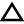
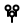
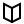
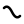
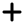
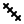
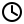

# caveLLMan

### 32 hieroglyphs. universal language. 30,000 years in the making.

No Python. No pip. No torch. Pure C.

---

## The 32 Signs

In 2016, paleoanthropologist Genevieve von Petzinger documented exactly **32 recurring geometric signs** across 146 European cave sites spanning 30,000 years. Lines, chevrons, circles, spirals, zigzags, hands — the same symbols from France to Indonesia to Australia. A shared cognitive vocabulary predating all known writing by 25,000 years.

caveLLMan is a GPT that speaks this language. 32 abstract hieroglyphs — semantic atoms that encode all of human experience. Not emoji. Not words. Signs. The kind a cave painter would recognize.

The model learns which atoms follow which. Light follows dark. Grief follows love. Creation follows destruction. The grammar of being alive, compressed into 32 symbols and a tiny transformer.

## The 32 Hieroglyphs

<table>
<tr><th colspan="4">ELEMENTS</th></tr>
<tr>
<td align="center"><br><sub>light</sub></td>
<td align="center"><br><sub>dark</sub></td>
<td align="center"><br><sub>water</sub></td>
<td align="center"><br><sub>fire</sub></td>
</tr>
<tr><th colspan="4">EARTH</th></tr>
<tr>
<td align="center"><br><sub>tree</sub></td>
<td align="center"><br><sub>mountain</sub></td>
<td align="center"><br><sub>home</sub></td>
<td align="center"><br><sub>path</sub></td>
</tr>
<tr><th colspan="4">BODY</th></tr>
<tr>
<td align="center"><br><sub>strength</sub></td>
<td align="center"><br><sub>pain</sub></td>
<td align="center"><br><sub>sleep</sub></td>
<td align="center"><br><sub>food</sub></td>
</tr>
<tr><th colspan="5">EMOTION</th></tr>
<tr>
<td align="center"><br><sub>joy</sub></td>
<td align="center"><br><sub>grief</sub></td>
<td align="center"><br><sub>love</sub></td>
<td align="center"><br><sub>fear</sub></td>
<td align="center"><br><sub>anger</sub></td>
</tr>
<tr><th colspan="3">PEOPLE</th></tr>
<tr>
<td align="center"><br><sub>person</sub></td>
<td align="center"><br><sub>child</sub></td>
<td align="center"><br><sub>group</sub></td>
</tr>
<tr><th colspan="4">MIND</th></tr>
<tr>
<td align="center"><br><sub>idea</sub></td>
<td align="center"><br><sub>knowledge</sub></td>
<td align="center"><br><sub>sound</sub></td>
<td align="center"><br><sub>prayer</sub></td>
</tr>
<tr><th colspan="4">ACTION</th></tr>
<tr>
<td align="center"><br><sub>create</sub></td>
<td align="center"><br><sub>destroy</sub></td>
<td align="center"><br><sub>seek</sub></td>
<td align="center"><br><sub>death</sub></td>
</tr>
<tr><th colspan="4">GRAMMAR</th></tr>
<tr>
<td align="center"><br><sub>not</sub></td>
<td align="center"><br><sub>many</sub></td>
<td align="center"><br><sub>when</sub></td>
<td align="center"><br><sub>and</sub></td>
</tr>
</table>

32 symbols. Each one abstract — a semantic atom, not a picture. Combinations create meaning:

```
light + water  = morning by the sea
grief + child  = loss of innocence
fire  + anger  = rage
path  + seek   = pilgrimage
create + knowledge = discovery
person + not   = loneliness
```

## Quick Start

```bash
make            # build with BLAS
make cpu        # build without BLAS (portable)

# Train on 15K glyph stories
./train_emolm --dataset data/cavellman_15k.txt --preset small --steps 10000

# Infer
./infer_emolm --weights weights/cavellman_v1.bin --preset small
```

Built on [notorch](https://github.com/ariannamethod/notorch) — pure C, no dependencies.

## Generated Stories

```
light water food strength joy
dark fire fear group and strength
love death grief many dark prayer
person seek person love joy home
mountain path seek strength light
pain water sleep food strength joy
```

Each story is a narrative arc in 32 hieroglyphs.

## Presets

| Preset | Params | Embd | Heads | Layers | CTX |
|--------|--------|------|-------|--------|-----|
| `tiny` | ~16K | 18 | 3 | 2 | 32 |
| `micro` | ~100K | 48 | 4 | 3 | 64 |
| `standard` | ~200K | 64 | 8 | 3 | 64 |
| `small` | ~500K | 96 | 8 | 4 | 128 |
| `medium` | ~1M | 128 | 8 | 4 | 128 |

## Architecture

```
Token Embedding + Positional Embedding
          |
       RMSNorm
          |
  +--- Transformer Block (xN) ---+
  |  RMSNorm -> Multi-Head Attn  |
  |  + Residual                   |
  |  RMSNorm -> FFN (SiLU)       |
  |  + Residual                   |
  +-------------------------------+
          |
     Linear -> Softmax -> Loss
```

Optimizer: [Chuck](https://github.com/ariannamethod/chuck.optimizer) — self-aware AdamW with damping, stagnation detection, noise injection.

## Credits

Inspired by [emojiGPT](https://github.com/MattWenJun/emojiGPT) by @MattWenJun (browser GPT on @karpathy's microGPT). Rebuilt from scratch: C engine on [notorch](https://github.com/ariannamethod/notorch), 32-glyph alphabet, cave-painting SVG hieroglyphs, 15K training stories — by [Arianna Method](https://github.com/ariannamethod).
