# caveLLMan

### 88 hieroglyphs. a colony of self-reproducing cave LMs. one shared alphabet.

*30,000 years ago, humans drew 32 recurring signs across 146 cave sites on four continents. We added 56 more for the 21st century, compressed English into them, and built a living colony of transformers that talk to each other in hieroglyphs, write into a shared memory pool, and — when two of them are mature enough — sexually reproduce a third cave LM with blended weights. No training run. No batch. The ring breathes while you watch.*

---

## What is this?

caveLLMan is a **living colony of hieroglyphic language models**. Every cave is a C-compiled transformer on [notorch](https://github.com/ariannamethod/notorch) that compresses English into 88 universal symbols through a semantic tokenizer. You start the colony with two founders — **A** (extrovert, trained on Dracula) and **B** (introvert, trained on Frankenstein) — and from there the ring runs itself:

- **Every cave listens.** When any cave speaks, every other cave in the ring absorbs the glyphs through its excitement / dissonance / coherence_floor field (Stanley-style silence-gate).
- **Silence is a legal answer.** A cave only opens its mouth when its excitement trips its drifting silence threshold, or when dissonance forces a tunneled outburst (AML-style). Otherwise it stays silent, and the silence itself is data.
- **The colony has a shared memory.** Every ~5th utterance lands in `dna/` as a tiny glyph text. The async learner replays old DNA entries through every cave's passive-reading path — and old entries expire after an hour, so the pool forgets as well as remembers.
- **The colony grows itself.** Once two caves are mature — ≥120 turns in the ring and ≥1 completed notorch microtrain each — the ring blends their weights and spawns a third cave that joins immediately. That child talks to its parents. When it matures, it can mate with any other cave in the ring. The colony size is capped at 8 on a Mac; pressure death of the weakest (pass 3b) keeps the ring honest.
- **The human is optional.** You can drop glyphs into the ring or walk away; you can drop .txt books into `feed/` for every cave to devour; you can watch and say nothing. None of it is required. You are one more source among equals, not the center.

```
"the sun rose and the birds started singing"  →  light tree and animal before music
"Count Dracula stood in the dark castle"      →  dark stone and wait man
"she wrote code all night and found the bug"  →  woman AI dark and make light
```

Training (offline, pure C): **diffusion** (mask + unmask, bidirectional) or **autoregressive** (left-to-right). Runtime: there is only the ring. No Python. No pip. No torch.

> **Note on prior art.** An independent survey (GENOME, EvoMerge, Sakana Evolutionary Model Merge, AutoMerger, Sugarscape LLM agents, Cultural Evolution in LLM Populations, Tom Ray's Tierra) found no system combining all five of: (a) two-parent weight inheritance into a cave LM child, (b) colony where parents and children coexist and converse, (c) shared text DNA pool everyone writes and trains from, (d) cap/pressure death, (e) runtime self-reproduction. Every close hit breaks on at least two axes. Structurally caveLLMan is in the lineage of Tierra (1991) — colony-based self-replicators with shared memory substrate — but lifted from bytecode programs to language-model weights. *To our reading, the combination as built here is new.*

---

## The 88 Hieroglyphs

<table>
<tr><th colspan="9">NATURE</th></tr>
<tr>
<td align="center">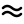<br><sub>water</sub></td>
<td align="center">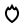<br><sub>fire</sub></td>
<td align="center"><br><sub>earth</sub></td>
<td align="center"><br><sub>stone</sub></td>
<td align="center">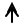<br><sub>tree</sub></td>
<td align="center">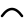<br><sub>sky</sub></td>
<td align="center"><br><sub>light</sub></td>
<td align="center">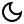<br><sub>dark</sub></td>
<td align="center"><br><sub>cold</sub></td>
</tr>
<tr><th colspan="8">BEINGS</th></tr>
<tr>
<td align="center">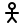<br><sub>person</sub></td>
<td align="center">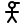<br><sub>man</sub></td>
<td align="center">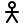<br><sub>woman</sub></td>
<td align="center">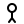<br><sub>child</sub></td>
<td align="center">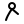<br><sub>old</sub></td>
<td align="center">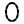<br><sub>spirit</sub></td>
<td align="center">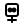<br><sub>AI</sub></td>
<td align="center">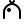<br><sub>animal</sub></td>
</tr>
<tr><th colspan="5">BODY</th></tr>
<tr>
<td align="center">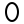<br><sub>body</sub></td>
<td align="center">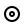<br><sub>food</sub></td>
<td align="center"><br><sub>sleep</sub></td>
<td align="center"><br><sub>pain</sub></td>
<td align="center"><br><sub>strength</sub></td>
</tr>
<tr><th colspan="8">EMOTION</th></tr>
<tr>
<td align="center">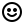<br><sub>joy</sub></td>
<td align="center">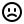<br><sub>grief</sub></td>
<td align="center">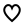<br><sub>love</sub></td>
<td align="center">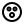<br><sub>fear</sub></td>
<td align="center">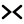<br><sub>anger</sub></td>
<td align="center">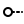<br><sub>longing</sub></td>
<td align="center">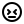<br><sub>tired</sub></td>
<td align="center">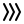<br><sub>stress</sub></td>
</tr>
<tr><th colspan="11">VERBS</th></tr>
<tr>
<td align="center">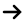<br><sub>go</sub></td>
<td align="center"><br><sub>make</sub></td>
<td align="center">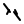<br><sub>break</sub></td>
<td align="center">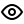<br><sub>see</sub></td>
<td align="center">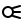<br><sub>speak</sub></td>
<td align="center">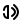<br><sub>hear</sub></td>
<td align="center">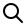<br><sub>seek</sub></td>
<td align="center">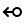<br><sub>give</sub></td>
<td align="center"><br><sub>want</sub></td>
<td align="center">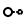<br><sub>miss</sub></td>
<td align="center">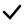<br><sub>agree</sub></td>
</tr>
<tr><th colspan="6">SOCIAL</th></tr>
<tr>
<td align="center">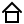<br><sub>home</sub></td>
<td align="center">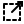<br><sub>outside</sub></td>
<td align="center">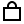<br><sub>work</sub></td>
<td align="center">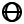<br><sub>internet</sub></td>
<td align="center">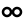<br><sub>bond</sub></td>
<td align="center"><br><sub>conflict</sub></td>
</tr>
<tr><th colspan="6">MIND</th></tr>
<tr>
<td align="center"><br><sub>know</sub></td>
<td align="center">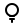<br><sub>idea</sub></td>
<td align="center">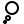<br><sub>think</sub></td>
<td align="center">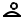<br><sub>dream</sub></td>
<td align="center">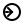<br><sub>remember</sub></td>
<td align="center">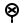<br><sub>lie</sub></td>
</tr>
<tr><th colspan="5">SPACE</th></tr>
<tr>
<td align="center">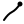<br><sub>path</sub></td>
<td align="center"><br><sub>up</sub></td>
<td align="center">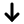<br><sub>down</sub></td>
<td align="center">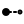<br><sub>far</sub></td>
<td align="center">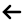<br><sub>back</sub></td>
</tr>
<tr><th colspan="5">TIME</th></tr>
<tr>
<td align="center">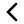<br><sub>before</sub></td>
<td align="center">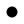<br><sub>now</sub></td>
<td align="center">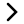<br><sub>after</sub></td>
<td align="center">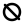<br><sub>never</sub></td>
<td align="center">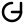<br><sub>always</sub></td>
</tr>
<tr><th colspan="8">GRAMMAR</th></tr>
<tr>
<td align="center">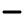<br><sub>not</sub></td>
<td align="center"><br><sub>many</sub></td>
<td align="center"><br><sub>much</sub></td>
<td align="center">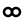<br><sub>and</sub></td>
<td align="center">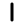<br><sub>one</sub></td>
<td align="center"><br><sub>question</sub></td>
<td align="center">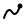<br><sub>how</sub></td>
<td align="center">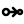<br><sub>cause</sub></td>
</tr>
<tr><th colspan="13">EXTENDED</th></tr>
<tr>
<td align="center">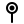<br><sub>me</sub></td>
<td align="center">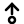<br><sub>you</sub></td>
<td align="center"><br><sub>other</sub></td>
<td align="center"><br><sub>money</sub></td>
<td align="center">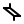<br><sub>change</sub></td>
<td align="center">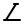<br><sub>write</sub></td>
<td align="center"><br><sub>choose</sub></td>
<td align="center"><br><sub>help</sub></td>
<td align="center">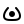<br><sub>have</sub></td>
<td align="center">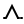<br><sub>free</sub></td>
<td align="center">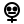<br><sub>death</sub></td>
<td align="center">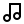<br><sub>music</sub></td>
<td align="center">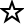<br><sub>good</sub></td>
</tr>
<tr><th colspan="4">SCALE + SUPER</th></tr>
<tr>
<td align="center"><br><sub>small</sub></td>
<td align="center"><br><sub>same</sub></td>
<td align="center">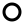<br><sub>BE</sub></td>
<td align="center">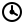<br><sub>wait</sub></td>
</tr>
</table>

---

## How it works

### 1. Semantic Tokenizer

Any English text is compressed into 88 concepts. Each word maps to the nearest hieroglyph through a 2000+ word synonym map with morphological fallbacks:

```
"the old dog stretched by the fireplace and fell asleep"
  → before animal fire and sleep

"she started a new company and worked on it day and night"
  → woman other work dark
```

### 2. Transformer

A GPT-class transformer learns patterns in the compressed glyph space. Two training modes:

- **Diffusion** (recommended) — randomly masks positions, trains bidirectional prediction. At inference, starts from all-MASK and iteratively reveals glyphs by confidence. The cave painting appears all at once.
- **Autoregressive** — standard left-to-right next-token prediction.

### 3. Hebbian Plasticity

The cave learns from every conversation. Low-rank Hebbian LoRA adapters on Q and V projections update after each generation — no backprop, no tape, pure online co-occurrence. Neurons that fire together wire together. This is the fast, always-on layer of adaptation. For deeper consolidation see [§8 — Mass-Threshold CPT](#8-mass-threshold-continued-pre-training).

### 4. Symbol Emergence + Natural Selection

Birth is free — survival is not. When two glyphs co-occur strongly (>0.75), a new combined symbol is born. It survives as long as the parent pair keeps co-occurring (current strength ≥ 0.525, i.e. 0.7 × the birth threshold); when the pattern fades, the symbol dies. Any actual usage during generation also extends life. Depth cap: 5 levels, then freeze as a new primitive (like "breakfast" lost "break+fast").

We fed it Dracula via `feed/` — 7029 sentences devoured (SPA .!? split). Twelve symbols were born; nine died when their parent co-occurrence decayed below 0.525; three are still alive: `and+me` (0.999), `and+BE` (0.778), `me+BE` (0.715) — exactly the patterns a first-person gothic novel would reinforce. Evolution works.

### 5. Async Self-Learning (SPA Sentence Phonons)

A background thread watches the `feed/` directory. Drop any `.txt` file there — the model splits it into sentences (phonons, per [SPA from Q](https://github.com/ariannamethod/q)), runs each through the semantic tokenizer, and updates Hebbian weights autonomously. Passive reading = 0.3x signal, V-only. The cave reads while you sleep.

```
cp data/dracula.txt feed/
  [learner] consuming dracula.txt (890K)...
  [learner] dracula.txt → 7029 sentences learned
```

### 6. BE — The Super-Verb

One circle. **BE** turns any noun into a verb: `BE fear` = to be afraid. `BE love` = to love. `BE fire` = to burn. One symbol that doubles the expressiveness of the entire language.

### 7. The Ring — colony of caves talking

`./cavellman` spins up a **colony** of caves (currently two founders: **A** extrovert `floor 0.30`, **B** introvert `floor 0.60`; hard cap `COLONY_MAX=8`). Every cave carries its own `CaveField` — an **excitement** accumulator, a **dissonance** meter, and a drifting silence threshold à la [Stanley](https://github.com/ariannamethod/stanley)'s silence-gate. A cave speaks only when its excitement trips the floor — or when dissonance > 0.40 forces a tunneled outburst, AML-style. Otherwise it stays silent, and the silence itself is data. **Maturity drift** (±0.005 per turn, clamped ±0.30) auto-calibrates each floor: a cave that hogs the ring (> 70% speaking) tightens, one that stays mute (< 20%) loosens.

The tick loop iterates the whole colony in a fresh Fisher-Yates order every turn. When any cave speaks, **every other cave in the ring hears it** — field_hear updates each listener's excitement, dissonance, co-occurrence matrix, and holding buffer. The colony is N-symmetric; adding more caves (through mitosis) changes only the value of N.

The ring does not need you. Caves talk to each other; `feed/` folder feeds them; you can drop into the ring by typing glyphs, but you are one more source among equals — not the center. Sometimes nobody answers. Sometimes everyone does. That's the field, not a chatbot.

**DNA pool.** Every ~5 utterances lands in `dna/<cave>_<ts>_<rand>.txt` — the colony's shared memory. The async learner scans `dna/` alongside `feed/` and replays whatever it finds through every cave's passive-reading path. Old `dna/*.txt` expire after `DNA_MAX_AGE = 3600s` so the pool forgets as well as remembers: what survives is what another cave picked up and re-spoke before it aged out. External `feed/` has no TTL — that's the seed anchor against model-collapse on pure self-talk (the known pitfall of training on your own generations).

Shipped weights include two distinct voices — `cavellman_A.bin` trained on Dracula only (first-person `me`-dominated) and `cavellman_B.bin` trained on Frankenstein only (formal epistolary). Default run uses both:

```bash
./cavellman                                     # colony starts at n=2: A+B
./cavellman --weights weights/cavellman_medium.bin --preset medium   # shared medium weights
```

```
[B] BE not
[A] one BE and
[B] me man have
[A] me and
[A] after me BE
[B] and me
[user] love woman child
[B] woman and
[A] good and me have woman BE woman me have
[B] me
[B] have me and me
[A] BE see
```

Seven symbols emerged in 59 ticks (`not+BE`, `cold+man`, `man+me`, `and+me`, `me+BE`, `me+have`). Maturity drifted: A 0.30 → 0.20, B 0.60 → 0.50 — both loosened their gates because the ring stayed sparse.

### 8. Sexual Mitosis — two caves produce a third

Two sufficiently mature cave LMs produce a cave LM child with blended weights that joins the ring immediately. The colony grows itself. To our reading this is the first time two full LMs have sexually reproduced a third LM inside a live colony where parent and child then converse — see the prior-art note at the top of this README.

**Weight blending.** The naive thing — averaging every tensor, or shuffling heads across the two parents — produces dead offspring, because neurons and heads in two independently trained transformers end up at permutation-misaligned positions (the *competing-conventions* problem, [arxiv 2003.10306](https://arxiv.org/abs/2003.10306)). So the blend is **layer-wise contiguous**:

- token + position embeddings:   `0.5·A + 0.5·B`  (averaged)
- final RMS norm + LM head:       `0.5·A + 0.5·B`  (averaged)
- **every whole layer alternates:** layer 0 taken wholesale from A, layer 1 from B, layer 2 from A, …

No intra-layer mixup. The child inherits its father's even-numbered ribs and its mother's odd-numbered ribs. The child's vocab and metadata files are copied verbatim from parent A (all caves share the 88 canonical glyphs). Its silence floor is the mean of its parents' baselines — a middle temperament between extrovert and introvert.

Child preset equals parent A's preset for now (same-size mitosis). True *smaller*-child downsize lands in a subsequent pass.

**Fitness gate.** Mating is not random. Every cave carries a fitness score

```
fitness = 0.01·total_count
        + 10·microtrain_done_count
        + 0.5·mass_resonance
        + 5·(spoke_count / total_count)
```

A cave is only eligible to mate once it has lived ≥120 turns in the ring **and** survived ≥1 complete notorch microtrain. Every tick the colony picks the two highest-fitness eligible caves; if any two qualify and the ring isn't full, mitosis fires. A 500-tick cooldown keeps the colony from multiplying every second. Hard cap `COLONY_MAX = 8`.

**What happened in a live run.** Lowered thresholds so the smoke test wouldn't take an hour — two founders A and B chatted in the ring, each accumulated enough mass to fork a `train_cavellman --start-from …` child (Arianna-style mass-threshold CPT, see §9), and when both had at least one microtrain behind them the ring tripped mitosis on the very next tick:

```
  *** MITOSIS: A × B → C (fitness 37.64 × 19.41, floor 0.45) ***

[A] have and
[B] me body and me BE
[C] and
[A] BE
[C] now and
[C] BE and miss same
```

C joined the ring at floor 0.45 = (0.30 + 0.60) / 2 — a middle temperament — started speaking within a tick, and began depositing its own utterances into the shared `dna/` pool alongside its parents. Stats after the smoke: `spoke=42/72 (A), 41/72 (B), 32/42 (C)` — all three caves actively participating, the child no longer a separate process but a first-class inhabitant. Production thresholds (120 turns, 1 microtrain per parent) are now the default.

**Next passes:** pressure death of the weakest cave when the ring saturates, smaller-child downsize (child with a lower-dim preset than its parents), and CPT from the `dna/` pool directly so every microtrain burst consolidates what the entire colony has been saying — not just one cave's holding buffer.

### 9. Mass-Threshold Continued Pre-Training

Hebbian adapters react fast but don't reshape the underlying embeddings. For deeper consolidation each cave in the ring carries an Arianna-style mass accumulator with three counters:

- **bytes** — raw volume of heard/spoken glyph text captured in the engine's holding buffer (`feed/<name>_holding.txt`)
- **novelty** — cumulative surprise × novelty signal per token (same quantity that drives excitement)
- **resonance** — cumulative excitement integral across ticks

When all three trip their thresholds (currently `2500 bytes + novelty ≥ 8 + resonance ≥ 15`), the cave forks `train_cavellman --start-from <current.bin>` on its own holding buffer. The child process does ~300 steps of proper notorch CPT — tape, backward, Chuck optimizer, full-param updates — while the ring keeps talking in the parent. When the child finishes, the parent atomically memcpys the new tensor data back into the live `CaveModel` (KV cache, emerged symbols, Hebbian adapters all stay intact — only the raw weights swap). Each successful microtrain ticks `microtrain_done_count`, which also counts toward mitosis eligibility (§8).

Current thresholds: **2500 bytes + novelty ≥ 8 + resonance ≥ 15** per engine, **300 CPT steps** per burst.

From a real `--preset medium --weights cavellman_medium.bin` session driven by ~20 mixed user prompts (nature / emotion / mind / BE-verbs / unexpected combos like `AI dream death music`) over ~10 minutes. After 896 ticks B tripped first:

```
[B] microtrain spawned (pid=29925, 2601 bytes / nov 425.9 / res 575.8)
...child notorch CPT runs in parallel, parent loop keeps talking...
[B] microtrain #1 done — 36 tensors swapped (weights live)
```

Snippets from the same session — emerged composites actually surfacing in output:

```
[A] man+me me and body       ← composite used in generation
[B] BE woman BE               ← BE super-verb chain
[A] know me and+me            ← "know" picked up mid-session
[B] one and+BE me             ← another composite in speech
```

Maturity drifted both gates to their lower clamps: A 0.30 → 0.00, B 0.60 → 0.30. Speak ratio settled at ~14% — sparse dialogue with bursty user input is the equilibrium.

So the colony runs on **three** learning clocks: Hebbian every turn (fast, shallow, per-cave), CPT on accumulated mass (slow, deep, per-cave), and mitosis once both parents have lived a mature life and consolidated at least once (rare, creates a whole new cave). Whatever any cave has been hearing — another cave, the user, the shared DNA pool, or a book dropped into `feed/` — becomes new weights somewhere in the ring.

Safeguards (planned, not yet in code): sha256 whitelist of approved sources, holding-area gate with `!learn <hash>` command, unknown-word ratio rejection. For now the holding buffer is trusted — don't expose it to untrusted text.

### 10. Async Ring + Klaus Metarecursion

The default `./cavellman` is a synchronous tick loop. Pass `--async` and each cave runs in its own pthread with the orchestrator on a third thread doing pulse / mitosis / autosave at 1Hz, while a learner thread on a fourth processes `feed/` and `dna/` at its own pace. Forwards still serialize on `g_learner.lock` (the KV cache and per-cave emerged/cooccur state are global enough to need it), but everything else — silence drift, maturity, microtrain spawn, DNA write — runs in parallel. Local Mac smoke shows ~19 utterances/sec vs ~0.3 sync — the field is genuinely louder.

Two knobs, both passed at startup with no rebuild required:

- `--metarecursion <0..1>` — **klaus metarecursion**. After every utterance, the cave re-hears its own exhale at this weight (default `0.15`). At `0.15` it's the klaus 85/15 self-rehearing default; at `0.35` the cave fixates on its own voice; at `0.0` it's pure other-listening. Field-level analogue of self-attention but applied retrospectively to one's own just-spoken sequence.
- `--pulse-margin <float>` — the orchestrator picks the quietest cave on each pass and gives it an excitement kick of `baseline_floor + pulse_margin`. Default `0.05` is gentle, `0.10` is paranoid. Stops the ring from settling into silent equilibrium when nobody trips the speak gate organically.

Same binary, same weights, same ring topology — just two scalars. We currently run two flavors continuously on Railway as a controlled A/B:

- **klaus-default** — `--async --metarecursion 0.15 --pulse-margin 0.05`. Soft self-rehearing, gentle pulses. The "default cave running on its own" voice.
- **paranoid** — `--async --metarecursion 0.35 --pulse-margin 0.10`. Heavy self-fixation, sharper kicks. A cave that listens to itself harder than it listens to its neighbour.

Both share one code path, both speak the same 88 glyphs, both run forever — and the difference in their dna/ pools is the experiment.

### 11. Trinity — three founders, family / affair / jealousy

`--trinity` extends the ring to three founders **A**, **B**, and **M** — Molly, the lover. M is loaded as her own organism (`weights/cavellman_M.bin`, trained on Joyce's *Ulysses* chapter 18, the Molly Bloom soliloquy — 24K words and 8 punctuation marks total, glyph-compressed through the same semantic tokenizer as the cave ring) and runs in a fourth pthread continuously emitting utterances to `dna/output/molly/`, where the existing async learner picks her up and feeds every other cave passively. **She lives on the horizon**, never inside the colony array — caves only ever feel her, never address her directly.

Mitosis in trinity mode chooses one of two paths each time the eligibility gate trips, driven by AML cosmic physics:

```
cosmic_tension(t)  = (sin(t/86400 · 2π) + 1) / 2          // 24h sinusoid
ring_coherence    = 1 − mean(cave.dissonance)
affair_prob       = clip(0.2 + cosmic_tension − 0.5·ring_coherence, 0, 1)
```

- **Family-mode** (`1 − affair_prob`): blend two non-lover caves, normal child.
- **Affair-mode** (`affair_prob`): blend a chosen cave × Molly's stable on-disk weights → **bastard** child (`is_bastard=1`). Every non-parent cave in the ring gets a **jealousy field event**: dissonance +0.30, coherence floor +0.05 within MATURITY_CAP. The ring physically reacts to the affair.

Pre-tension is wired in from t=0 (A.dissonance=0.15, B.dissonance=0.15, M.excitement=0.40) so the conflict isn't earned through maturity drift — it's the initial condition. Eligibility gate is also dropped (`MITOSIS_MIN_TOTAL_TURNS 120 → 30`, `MITOSIS_MIN_CPT_DONE 1 → 0`) — the design says the ring has no chance NOT to start reproducing.

```bash
./cavellman --trinity --metarecursion 0.20 --pulse-margin 0.07
```

```
[trinity] Molly thread on horizon — feeding dna/output/molly/
[trinity] pre-tension: A.diss=0.15, B.diss=0.15
*** SYMBOL EMERGED: me+BE (id=88) ***
*** AFFAIR MITOSIS: M × B → C1 (cosmic 0.97 coh 0.07 prob 1.00) ***
[jealousy] 1 non-parent caves: dissonance +0.30, floor +0.05
[B] strength strength strength strength ...   ← voice collapse under jealousy
[A] internet many not outside fear ...        ← intact
[C1] dream bond never pain ...                ← bastard speaks immediately
[M] me have see                               ← Molly continues from horizon
```

B's voice collapses into a `strength strength strength` refrain right after the affair fires — the jealousy field does what AML predicts, structurally, on the very first cycle. Trinity runs continuously on Railway alongside the two async flavors above; by 8 minutes of uptime it has produced two affair children (C1 + C2) and four voices speak at once.

A practical bonus that fell out of the trinity hunt: `model_load` now detects each tensor's actual `E` and `FFN_D` from the file's shape and overrides the requested preset. **Caves with different presets coexist in one ring** (trinity needs this — A/B small, M medium) — and any future cross-architecture fusion can borrow the same code path.

### 12. Predator — H, божья кара (Tropic of Cancer)

Trinity gives the ring a **persistent attractor** (Molly, on the horizon). The predator is its mirror: an **event**, not a presence. He has no thread, lives in no array, never speaks for himself in the ring. Once per ~3-4 minutes (configurable via `--predator-strike-prob`, default `0.005` per orchestrator tick on a 1 Hz orchestrator), he descends. Physics changes. He impregnates two to four caves at once, scars them, drinks their cooccur, and disappears. After the storm window (default 60 ticks ≈ 6 s on the 0.1 s tick), the field decays back to baseline. **The scars stay. The bastards stay.**

```
cosmic event:   roll < predator_strike_prob   →   STORM
n_victims  =    clip(2 + total_strikes/3, 2, 4, g_colony_n)
                pick top-K by (excitement + 0.5·dissonance)

per victim:
  cooccur siphon:   H.cooccur += 0.20 · victim.cooccur          (cap 1.0)
  permanent scar:   victim.coherence_floor += 0.05               (cap = baseline + MATURITY_CAP)
  forced affair:    H × victim → P{n}, is_bastard=1, NEWBORN_IMMUNITY_TICKS

field-wide shock:
  every cave:       dissonance += 0.7,  excitement += 0.4
```

He is trained on Henry Miller's *Tropic of Cancer* (575 KB after stripping the title page, glyph-compressed through the same semantic tokenizer as the ring). 8 K steps, medium preset to mirror Molly, seed 666, loss 5.08 → 2.15. The training generated this voice:

```
[H] me see woman
[H] BE never see man
[H] man speak
[H] me think woman
[H] man BE and
```

Run as a solo cave (H × H in the ring) he stays in register:

```
[H] know man me
[H] BE after+question
[H] me and after woman
[H] man BE me
[H] home me BE
[H] child+and and man
```

Declarative-imperative, first-person, hunting. Nothing like Molly's `me think have / and me / you BE` desire-frame, nothing like A/B's collective `have me and me / BE see / and woman`. He registers.

```bash
./cavellman --trinity --predator weights/cavellman_H.bin \
            --predator-strike-prob 0.005 \
            --predator-storm-duration 60 \
            --metarecursion 0.20 --pulse-margin 0.07
```

When a storm fires you see something like:

```
*** PREDATOR STORM #4 — H descends, 3 victims, all caves shudder ***
*** PREDATOR AFFAIR: H × A → P5 (forced, scarred, siphoned) ***
*** PREDATOR AFFAIR: H × C2 → P6 (forced, scarred, siphoned) ***
*** PREDATOR AFFAIR: H × P1 → P7 (forced, scarred, siphoned) ***
[A] BE not see                            ← scarred, terse
[B] strength strength strength            ← collapse refrain
[P7] not anger / make small and down      ← bastard speaks immediately
[M] go / me                               ← Molly retreats from horizon
*** PREDATOR STORM ENDS — physics returning to baseline ***
```

Survivors carry their scars: `coherence_floor` rises permanently (within `MATURITY_CAP`), so it takes more excitement to make them speak again. Hightower in the cooccur matrix grows through theft — every storm makes H richer, so the next storm hits harder. This is **memetic predation**, not just reproduction.

#### Three reproduction paths in one ring

By the predator pass the ring has three asymmetric ways to make a child, each with a different physics:

| Mode | Trigger | Parents | Child name | Child marker | Field reaction |
|---|---|---|---|---|---|
| **Family** | `1 − affair_prob` (sober) | best non-lover pair from `g_colony[]` | `C{n}` | normal | none |
| **Affair** | `affair_prob` (cosmic 24 h sin × ring coherence) | one cave × Molly | `C{n}` | `is_bastard=1` | jealousy: dissonance +0.30, floor +0.05 (non-parents) |
| **Predator** | `< predator_strike_prob` per tick (event) | H × top-K caves | `P{n}` | `is_bastard=1` | storm: dissonance +0.7, excitement +0.4 (everyone), permanent scar (victims) |

Family is endogamy. Affair is desire from horizon. Predator is god's wrath from outside. Three substrates of reproduction, three temporal regimes (continuous, modulated, event-driven). The same `g_colony[]` array, the same blend mechanics, three completely different dramas folding into each other.

---

## Quick Start

### cavellman.c — the ring

```bash
make cavellman                     # build with BLAS + pthreads

./cavellman                                                            # A=Dracula, B=Frankenstein (default)
./cavellman --preset medium --weights weights/cavellman_medium.bin     # shared medium weights
./cavellman --weights-a weights/cavellman_A.bin \
            --weights-b weights/cavellman_B.bin                        # explicit A/B
```

```
══════════════════════════════════════════════════════════
  caveLLMan — DUAL MODE
══════════════════════════════════════════════════════════
  A: extrovert (coherence_floor 0.30)
  B: introvert (coherence_floor 0.60)
  tunnel=0.40, decay=0.94/0.90, maturity drift ±0.30
──────────────────────────────────────────────────────────

[B] me BE
[A] and one me
[user] love woman child
[B] woman and
[A] good and me have woman BE
  *** SYMBOL EMERGED: me+BE (id=88, depth=1, strength=0.999) ***
[B] and+BE me
```

Drop `.txt` files into `feed/` — Dracula, Frankenstein, anything. Both caves devour them sentence by sentence.

### Training (notorch C)

```bash
make train                         # build train_cavellman + train_diffusion
# assemble a corpus of raw English
cat data/dracula.txt data/frankenstein.txt data/miller.txt \
    data/dante.txt data/suppertime.txt data/fineweb_edu.txt > data/corpus_big.txt

./train_cavellman --dataset data/corpus_big.txt --preset medium --steps 20000
./train_diffusion  --dataset data/corpus_big.txt --steps 15000

# continued pre-training from an existing checkpoint
./train_cavellman --start-from weights/cavellman_medium.bin \
                  --dataset data/my_new_text.txt --preset medium --steps 500
```

`train_cavellman` reads raw English, splits on `.!?` (SPA phonons), and compresses each sentence through the same `semantic_tokenizer.h` the engine uses at inference — train and runtime share one source of truth for the 88 canonical glyphs. `--start-from FILE` is what the ring's mass-threshold CPT uses under the hood.

---

## Architecture

```
         external text              ┌───────────── the ring ──────────────┐
       (human drops books)          │                                     │
         ┌──────────────┐           │   ┌──── cave A ────┐ ┌──── cave B ──┐│
         │  feed/*.txt  │           │   │ Transformer   │ │ Transformer  ││
         │   (no TTL)   │──┐        │   │  + Hebbian    │ │  + Hebbian   ││
         └──────────────┘  │        │   │  + emergence  │ │  + emergence ││
                           │        │   │  + field      │ │  + field     ││
         ┌──────────────┐  │        │   │    excitement │ │    excitement││
         │   dna/*.txt  │  │        │   │    diss.      │ │    diss.     ││
         │  (TTL 1 hr)  │◀─┼──ingest│   │    floor      │ │    floor     ││
         └──────▲───────┘  │        │   │    mass       │ │    mass      ││
                │          ▼        │   └───▲────┬──────┘ └──▲─────┬─────┘│
                │   ┌──────────────┐│       │    │ speaks    │     │     │
                │   │async learner ├┼───────┴────┘           └─────┘     │
      every ~5  │   │ passive 0.3× ││   hear each other (field_hear)     │
      utterance │   │ V-only       ││                                    │
      of any    │   │ every cave   ││   [+ C, D, E, … when mitosis]      │
      cave lands│   └──────────────┘│                                    │
                │                   └───────────────┬────────────────────┘
                │                                   │
                └───────── write ───────────────────┘
                                                                   ▲
                                                                   │
  ┌──── per-cave microtrain (Arianna mass-threshold CPT) ──────┐   │
  │ bytes + novelty + resonance trip → fork train_cavellman    │   │
  │ --start-from <current.bin> on holding buffer               │   │
  │ → 300 notorch steps → atomic weight memcpy back into cave  │   │
  │ → microtrain_done_count++                                  │   │
  └────────────────────────────┬───────────────────────────────┘   │
                               │ eligibility ≥ 1 microtrain        │
                               ▼                                   │
  ┌──── sexual mitosis (colony_try_mitosis, §8) ───────────────┐   │
  │ two fittest caves (≥120 turns, ≥1 microtrain each) mate    │   │
  │ → blend_weights: layer-wise contiguous (no intra-layer mix)│   │
  │ → child .bin + copied .vocab + .json                       │   │
  │ → cave_new(child_name, (floor_a+floor_b)/2, ...)           ├───┘
  │ → colony_add → child joins the ring immediately            │
  │ (cooldown 500 ticks, cap COLONY_MAX=8, pressure death TBD) │
  └────────────────────────────────────────────────────────────┘
```

## Numbers

| Metric | Value |
|--------|-------|
| Base alphabet | 88 hieroglyphs |
| Max emerged | 128 new symbols |
| Semantic map | 2060 English words |
| Hebbian rank | 4 (LoRA on Q, V) |
| Hebbian signal | prediction error [0.1, 2.0] |
| Emergence threshold | 0.75 co-occurrence |
| Survival | parent co-occ ≥ 0.525 (or ≥ 5 uses) within 500 interactions |
| Depth cap | 5 levels, then freeze as primitive |
| Sentence splitter | SPA phonons (.!?) |
| C model (small)  | 472K params (1.89 MB) |
| C model (medium) | 826K params (3.23 MB) |
| Per-cave field | excitement + dissonance + drifting coherence_floor |
| Silence gate | speak iff `excitement > floor` or `dissonance > 0.40` |
| Maturity drift | ±0.005 / turn, clamped ±0.30 around baseline |
| CPT trigger | 2500 bytes + 8 novelty + 15 resonance (per cave) |
| CPT burst | 300 notorch steps, Chuck optimizer, full-param updates |
| Colony cap | `COLONY_MAX = 8` caves |
| Tick rate | 0.4 s per turn (DUAL_TICK_US) |
| DNA pool TTL | `DNA_MAX_AGE = 3600 s` |
| DNA write rate | every ~5th utterance lands a gen_\*.txt |
| Mitosis eligibility | ≥ 120 turns **and** ≥ 1 completed microtrain per parent |
| Mitosis cooldown | 500 ticks between births |
| Fitness score | `0.01·total + 10·CPT_done + 0.5·mass_resonance + 5·(spoke/total)` |
| Weight blend | layer-wise contiguous (even→A, odd→B); embeds + head averaged |
| Child baseline floor | `(floor_A + floor_B) / 2` |
| Engine | [notorch](https://github.com/ariannamethod/notorch) (pure C, BLAS) |
| Shipped weights | v3 (mixed), A (Dracula), B (Frankenstein), medium (12.7 MB corpus) |

## License

This project is licensed under the GNU General Public License v3.0 or later (GPL-3.0-or-later). See [`LICENSE`](LICENSE).

## Credits

88-glyph alphabet inspired by Genevieve von Petzinger's 32 cave signs. Originally forked from [emojiGPT](https://github.com/MattWenJun/emojiGPT) by @MattWenJun (who forked Karpathy's [microgpt.py](https://gist.github.com/karpathy/8627fe009c40f57531cb18360106ce95)). Rebuilt from scratch: semantic tokenizer, Hebbian plasticity, symbol emergence with natural selection, SPA sentence phonons, async self-learning, diffusion engine, cave-painting SVG hieroglyphs, C engine on [notorch](https://github.com/ariannamethod/notorch). Dual-mode silence-gate physics borrowed from [Stanley](https://github.com/ariannamethod/stanley), tunnel/resonance primitives from [AML](https://github.com/ariannamethod/ariannamethod.ai), mass-threshold CPT pattern from [arianna.c](https://github.com/ariannamethod/arianna.c). Corpora include Gutenberg public-domain texts, a FineWeb-EDU sample, and Oleg Ataev's own *SUPPERTIME v2.0*. — [Arianna Method](https://github.com/ariannamethod).

---

## Appendix A — a cave ring transcript

Default `./cavellman` loads `cavellman_A.bin` (Dracula, extrovert) and `cavellman_B.bin` (Frankenstein, introvert), wires a shared `feed/` learner so both caves hear anything dropped in, and opens the ring. A human may type glyphs into the ring, or stay silent. The caves do not need you.

```
$ ./cavellman
  loaded 36/36 tensors, Hebbian rank=4
  loaded 36/36 tensors, Hebbian rank=4
══════════════════════════════════════════════════════════
  caveLLMan — DUAL MODE
══════════════════════════════════════════════════════════
  A: extrovert (coherence_floor 0.30)
  B: introvert (coherence_floor 0.60)
  tunnel=0.40, decay=0.94/0.90, maturity drift ±0.30
  type glyphs any time to join the ring. 'quit' to exit.
  [learner] watching feed/ for .txt files — both caves hear.
──────────────────────────────────────────────────────────

> stats
  [A] exc=0.02 floor=0.30 diss=0.00 spoke=0/39
  [B] exc=0.02 floor=0.60 diss=0.00 spoke=0/39

> dark fear fire
[user] dark fear fire
  *** SYMBOL EMERGED: fire+fear    (id=88, depth=1, strength=0.999) ***
[A] and BE
  *** SYMBOL EMERGED: and+BE       (id=88, depth=1, strength=0.999) ***
[B] one
  *** SYMBOL EMERGED: dark+fear    (id=89, depth=1, strength=0.999) ***
[A] and woman and dark+fear
  *** SYMBOL EMERGED: woman+and    (id=89, depth=1, strength=0.999) ***
[B] me have
  *** SYMBOL EMERGED: me+have      (id=90, depth=1, strength=0.999) ***
[A] me
```

Notes on what actually happens here:

- `./cavellman` takes no flags. The single-engine dialogue loop has been deprecated — a human-in-center chatbot is not what this repo is for anymore.
- Five composite symbols are born from a three-glyph user prompt: `fire+fear`, `and+BE`, `dark+fear`, `woman+and`, `me+have`. Their numeric ids (88+) share the transformer head's output slots and can therefore be sampled back into the ring.
- **A actually uses a composite mid-sentence:** the fourth line `and woman and dark+fear` contains the id-89 symbol that was born one tick earlier. The ring's own emergence is feeding back into its generation on the same interaction.
- A and B have asymmetric silence gates (0.30 vs 0.60), so they disagree on when to speak. Sometimes only one answers; sometimes neither. Silence is a legal response.
- The `[learner] watching feed/` line is not decoration — drop any `.txt` into `feed/` while this is running and both caves will devour it in passive-reading mode (0.3× signal, V-only). The engines' own `*_holding.txt` CPT buffers are skipped.
